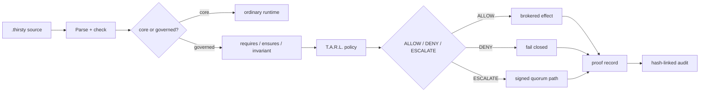
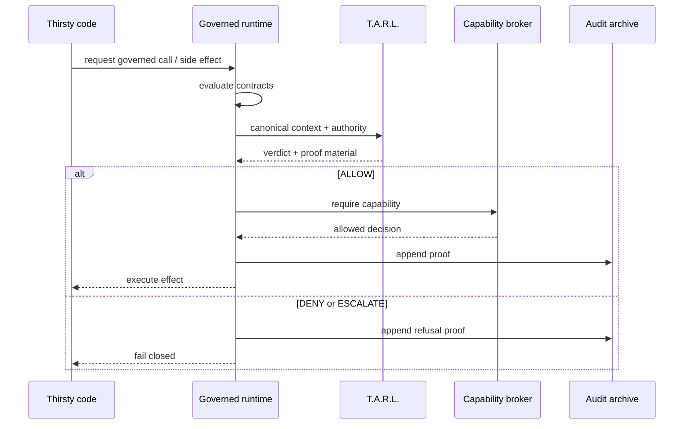
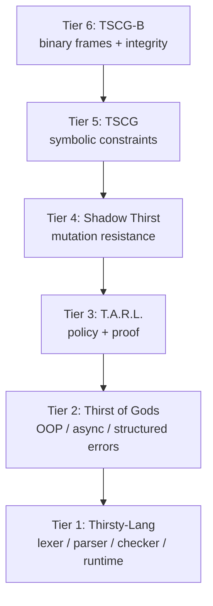

<div align="center">

# 💧 Thirsty-Lang 💧

### *A governance-first programming language family*

```text
  source  →  verdict  →  proof  →  audit  →  governed effect

  no policy  ·  no authority  ·  no silent downgrade
  DENY is the default  ·  governance IS the runtime

  ~ ~ ~  Code that has to justify itself before it acts.  ~ ~ ~
```

[](https://pypi.org/project/thirsty-lang/)
[](https://pypi.org/project/thirsty-lang/)
[](LICENSE)
[](https://github.com/IAmSoThirsty/Thirsty-lang/actions/workflows/smoke.yml)
[](https://github.com/IAmSoThirsty/Thirsty-lang/actions/workflows/release.yml)
[](https://github.com/IAmSoThirsty/Thirsty-lang/actions/workflows/docker.yml)
[](https://github.com/IAmSoThirsty/Thirsty-lang/stargazers)
[](https://github.com/IAmSoThirsty/Thirsty-lang/issues)

</div>

---

## What Is Thirsty-Lang?

The programming language wars are not over. **Governance is just getting started.**

Thirsty-Lang is not a prettier Python syntax. It is a **defensive runtime and
language stack** where execution, side effects, policy, proof, authority, audit,
mutation, symbolic constraints, and build outputs are all treated as governable
surfaces — not as afterthoughts bolted on after deployment.

Every other language asks: *can this code run?*
Thirsty-Lang asks a harder question: *should this code run, under the current
authority, policy, and context — and can it produce cryptographic proof that it
did so correctly?*

Instead of treating governance as documentation, middleware, or operational
policy applied after deployment, Thirsty-Lang treats **governance as part of
the execution model itself**. Sensitive operations require policy evaluation,
authority verification and proof generation before producing governed effects.
Deployments that require durable audit persistence must attach a
`TarlAuditArchive` and enable `set_require_audit(True)`; hardened mode alone
does not provision an archive.

The result is a language designed to make execution not only programmable, but
**explainable, attributable, and defensible** — by construction, not by
convention.

The core posture is non-negotiable:

| Principle | Consequence |
|---|---|
| 🌊 No policy | **DENY** |
| 🔐 No authority | **DENY** |
| 🧾 No proof | No governed-execution claim |
| ⚡ No verdict | No governed side effect |
| ⛓️ Required audit write fails | **DENY** when an archive is attached and audit is required |
| 🧱 Governance loss | Must be explicitly confessed — never silently dropped |

---

## Install

```bash
pip install thirsty-lang
```

Pinned release:

```bash
pip install thirsty-lang==0.8.6
```

From source:

```bash
git clone https://github.com/IAmSoThirsty/Thirsty-lang.git
cd Thirsty-lang
pip install -e .
```

## Canonical Manual

The end-to-end reference is the
[`Thirsty-Lang 101`](docs/THIRSTY_LANG_101.md) manual. Its generated single-file
edition is [`Thirsty-Lang-101.pdf`](output/pdf/Thirsty-Lang-101.pdf). It unifies
the language tutorial, exact grammar, all seven CLIs, T.A.R.L. policy and proof
contracts, the six-tier family, deployment, security, release evidence, and
source/test traceability for version 0.8.6.

---

## Quick Start

```thirsty
module hello: core

glass greet(name) {
    return "hello, " + name + "!"
}

drink message = greet("governed world")
pour message
```

```bash
thirsty run hello.thirsty
```

The welcoming syntax is only the surface. The power appears when your program
needs to touch something real — a file, a network call, a database write — and
the runtime demands a proof before it lets that happen.

---

## Architecture Map



---

## Why Thirsty-Lang?

Most languages answer one question well: *can this code execute?*

Thirsty-Lang asks harder questions:

- Who is acting?
- What authority was proven?
- Which policy allowed it?
- What exact context was evaluated?
- What proof was produced?
- Can the audit chain detect tampering?
- Can a build target preserve governance, or does it have to confess the loss?
- Can an agent or tool adapter reach a side effect without crossing the broker?

That is the war surface now. Syntax still matters. Performance still matters.
Ergonomics still matter. But **governance is becoming part of the language
runtime**, not a document stapled to the side.

```text
        source
          |
       parser
          |
   contracts + policy
          |
    ALLOW / DENY / ESCALATE
          |
       proof
          |
       audit
          |
   only then: effect
```

---

## Governed Execution

Governed code declares contracts and then passes through policy before sensitive
effects happen.

```thirsty
module bank: governed

glass withdraw(amt) requires amt > 0 ensures result >= 0 {
    return amt * 2
}
```

Runtime enforcement includes:

- 🧪 `requires`, `ensures`, and `invariant` checks
- 🚧 static and runtime blocking of governed calls from ordinary `core` mode
- 🧭 T.A.R.L. policy routing for governed calls and capability gates
- 🧾 proof-bearing `ALLOW`, `DENY`, and `ESCALATE` decisions
- 🛑 non-swallowable `GovernanceViolation` denials
- 🧯 fail-closed parsing for governed modules
- 📦 build refusal when a target would drop governance unless the loss is explicitly disclosed

---

## T.A.R.L.: Policy As Resistance

T.A.R.L. is Thirsty's Active Resistance Language. It is a policy engine built
around explicit verdicts, not optimistic defaults.

```tarl
policy access_control

when user.role == "admin" => ALLOW
when action == "delete" and resource == "critical" => ESCALATE
when user.ip in blacklist => DENY
when true => DENY
```

Dotted names are paths into nested JSON. The policy above expects
`{"user":{"role":"admin"}}`; a flat key such as
`{"user.role":"admin"}` is rejected. Missing, malformed, duplicate, and mixed
flat/nested representations fail closed and never become the ordinary boolean
value `false`.

Implemented policy surfaces include:

- 🌊 first-match-wins rule evaluation
- 🚦 `ALLOW`, `DENY`, and `ESCALATE` verdicts
- 🧪 sandboxed expression evaluation
- ⏱️ temporal policy windows
- 🔏 HMAC and Ed25519 proof certificates
- 🧷 strict proof verification flags for hardened use
- 🔁 replay, freshness, revocation, context, and policy-hash checks
- ⛓️ hash-linked audit archives with chain verification

---

## Resistance Flow



---

## Defensive Capabilities

Thirsty-Lang's defensive model is designed for hostile or ambiguous execution
contexts: agents, plugins, generated code, local scripts, imports, and tool
adapters.

| Current | Capability | Defensive effect |
|---|---|---|
| 🌊 | Default-deny governed mode | Missing policy, authority, or admissible proof refuses governed execution instead of granting it |
| 🚪 | Capability broker | External effects such as FFI/native calls and tool invocations can be mediated before execution |
| 🧰 | Sensitive stdlib gates | File, network, process, env, database, logging, and related calls are treated as capability-bearing effects |
| 🔐 | Signed authority claims | Hardened mode can require authenticated authority instead of trusting a raw string like `admin` |
| 🧾 | Proof verifier | Rejects tampered, stale, unsigned, wrong-key, revoked, or context-mismatched decisions when strict checks are enabled |
| ⛓️ | Hash-linked audit | Attached proof archives can detect edits, deletions, and reordering; production deployments must explicitly require persistence |
| ⏱️ | Trusted clock | Temporal policy can use signed time instead of the host clock |
| 🗺️ | Path guard | Filesystem roots can be canonicalized and confined against traversal and symlink escape |
| 🗳️ | Policy lint and quorum | Broad `ALLOW` rules are flagged; `ESCALATE` promotion requires a verified policy/schema-bound proof plus distinct digest-bound approvals |
| 🧯 | Parser fail-closed path | Governed parse errors discard recovered executable statements instead of running partial code |

The offensive challenge catalog is maintained in
[`docs/THREAT_MODEL.md`](docs/THREAT_MODEL.md). The feature matrix is maintained
in [`docs/STATUS.md`](docs/STATUS.md).

---

## The Six-Tier Stack



| Tier | Current | Name | What it contributes |
|---:|---|---|---|
| 1 | 💧 | Thirsty-Lang | Lexer, parser, checker, interpreter, formatter, CLI, module system, JS build target, contracts, and core syntax |
| 2 | ⚡ | Thirst of Gods | Object-oriented, async, and structured-error validation over the real AST |
| 3 | 🛡️ | T.A.R.L. | Policy-as-code, proof-carrying verdicts, temporal rules, composition, and audit hooks |
| 4 | 🌑 | Shadow Thirst | Mutation analysis, determinism checks, plane isolation, purity checks, resource estimation, and promotion blocking |
| 5 | 🧬 | TSCG | Symbolic constraint grammar with canonicalized constraint expressions |
| 6 | 📡 | TSCG-B | Binary frame protocol with CRC32 and SHA-256 integrity checks |

---

## Unique Language Features

Thirsty-Lang uses its own vocabulary, but the names map to concrete execution
behavior:

| Syntax | Current | Meaning |
|---|---|---|
| `drink` | 💧 | declares bindings |
| `pour` | 🌊 | outputs through the runtime |
| `glass` | 🥛 | declares functions |
| `fountain` | ⛲ | declares classes |
| `refill` | 🔁 | loops |
| `times` | ⏲️ | repeats a block |
| `spillage` / `cleanup` / `throw` | 🧯 | models structured error handling |
| `cascade` | ⚡ | models async flow |
| `requires` / `ensures` / `invariant` | 🧪 | turns governance into executable checks |
| `module name: governed` | 🛡️ | moves code into the governed execution path |

Example:

```thirsty
module counters: core

fountain Counter {
    drink count: Int = 0

    glass increment() {
        this.count = this.count + 1
        return this.count
    }
}

drink c = new Counter()
times 3 { pour c.increment() }
```

---

## CLI Surface

Primary commands:

```bash
thirsty --help
thirsty run program.thirsty
thirsty fmt program.thirsty
thirsty build program.thirsty --target js
thirsty build program.thirsty --target js --policy policy.tarl --emit-manifest
thirsty prove program.thirsty --policy policy.tarl --emit-manifest
thirsty explain-denial program.thirsty --policy policy.tarl
thirsty govern program.thirsty
thirsty lsp

tarl --help
tarl eval policy.tarl --context '{"role":"admin"}'
tarl eval dotted-policy.tarl --context '{"user":{"role":"admin"}}'
tarl eval temporal-policy.tarl --context '{"role":"admin"}' --now 2026-07-01T12:00:00Z
tarl verify proof.json --ed25519-only --context '{"user":{"role":"admin"}}'
tarl audit verify-chain audit.db

shadow-thirst --help
tscg --help
tscg-b --help
thirst-of-gods --help
```

| Command | Current | Surface |
|---|---|---|
| `thirsty` | 🌊 | run, format, build, static proof-obligation reports, denial explanations, govern, TARL LSP launcher, docs |
| `tarl` | 🛡️ | evaluate policies, verify proofs, inspect audits |
| `tarl-lsp` | 🧭 | run the T.A.R.L. language server directly |
| `shadow-thirst` | 🌑 | analyze mutation and promotion risk |
| `tscg` | 🧬 | parse and canonicalize symbolic constraints |
| `tscg-b` | 📡 | encode and decode binary constraint frames |
| `thirst-of-gods` | ⚡ | validate higher-tier language contracts |

Proof-oriented commands are static unless explicitly documented otherwise:

- `thirsty prove program.thirsty --policy policy.tarl --emit-manifest` parses,
  checks, and emits a machine-readable proof-obligation report without executing
  program side effects. The report includes functions, imports, sensitive
  stdlib calls, governed calls, required TARL actions, required capabilities,
  context schema, authority requirements, contract obligations, proof mode,
  audit requirement, governance-loss status, and unresolved proof gaps.
  Required TARL actions include capability actions and governed function-call
  actions.
- `thirsty explain-denial program.thirsty --policy policy.tarl` emits a
  machine-readable explanation of missing policy, context, authority, and proof
  conditions for the static obligation set.
- `thirsty build ... --emit-manifest --policy policy.tarl` records source and
  policy hashes, required capabilities, context schema, proof/audit
  requirements, Shadow status when statically visible, and governance-loss
  status in the build manifest.

Explicit context schemas can be attached with `--context-schema schema.json`.
The compact schema shape is:

```json
{"fields": {"user.role": "string", "risk": {"kind": "number", "required": false}}}
```

Schema field names and TARL expressions use the same dotted-path notation over
the authoritative nested representation. Generated schemas declare that
representation explicitly and request no silent normalization. Positive proofs
bind the original and canonical/evaluated context hashes, representation ID,
normalization algorithm ID and version, conflict status, schema fingerprint,
schema representation and validation result, policy hash, matched rule and
condition, verdict, trace, evaluation time, and applicable expiry.

A plain evaluator may return `ALLOW` without an attached schema, but that result
is not load-bearing advancement authority. `CapabilityBroker` and the governed
interpreter require a context-coherent positive proof whose explicit or complete
derived schema passed against the exact evaluated representation; otherwise
they replace the result with a fail-closed denial.

Expression integrity is eager. Both sides of `and`/`or` and every element of an
`ALL`/`ANY` quantifier are validated before their combined result is accepted,
so short-circuit order cannot hide a missing, malformed, or type-invalid value.
Empty quantifier collections fail closed instead of authorizing through vacuous
truth. Comparisons are type-strict: integers and floats interoperate, but strings
never coerce to numbers. Numeric operands and arithmetic results must be finite,
and quantifier binders beginning with the reserved `__tarl_` prefix are rejected.

When a runtime is using a derived schema and evaluates a different
`policy_text` override, it derives and proof-binds the schema for that exact
override. An incomplete override derivation fails closed; a base policy's
derived schema is never silently reused for another policy.

Registered sources are the only supported context transformation. Caller input
cannot contain reserved `source:*` fields. A source-dependent positive proof
preserves both the original request and source-enriched evaluated hashes, and
verification requires `--context` plus the exact `--evaluated-context`. Removing
the top-level `source:<name>` additions must reproduce the original context.

T.A.R.L. verification is secure by default: `tarl verify` and
`ProofVerifier()` reject unsigned proofs unless `--allow-unsigned` or
`ProofVerifier(require_signature=False)` is used explicitly for local
inspection. Signed proofs require one canonical lowercase hexadecimal
signature encoding, and replay identity binds the complete proof semantics,
signing key, algorithm, and decoded signature bytes. `tarl eval` refuses
temporal policy windows, time-bound verdicts,
`CURRENT_*`, and `ELAPSED_SINCE` unless `--now` supplies an explicitly zoned
trusted evaluation time. A configured runtime clock that is missing, naive, or
fails verification denies; it never falls back to the host clock. Temporal
metadata and durations parse strictly, `on_expiry` cannot grant `ALLOW`, and
matched decisions/proofs expire at the earliest exclusive policy or rule
cutoff.

Quorum promotion is proof-bound, not a vote over an unverified decision.
`QuorumResolver` requires an independently verified `ESCALATE` proof bound to
the exact policy and a passed authoritative context schema; the proof must have
a cryptographically verified signature even if the supplied verifier permits
unsigned inspection elsewhere. Each counted approval is Ed25519-signed over the
digest of the complete proof artifact, approver identity and public-key material
must both be distinct, and a time-bound promotion retains its signed expiry.
The resolver also requires the exact original request context, an explicit
timezone-aware trusted clock, and a verifier configured with a maximum proof age
and replay guard. Registered-source proofs additionally require the exact
source-enriched evaluated context. Any missing binding or control leaves the
decision at `ESCALATE`.

---

## Evidence-First Claims

This project keeps defensive claims tied to files that can be inspected:

- canonical end-to-end manual: [`docs/THIRSTY_LANG_101.md`](docs/THIRSTY_LANG_101.md)
- status matrix: [`docs/STATUS.md`](docs/STATUS.md)
- adversary model and challenge catalog: [`docs/THREAT_MODEL.md`](docs/THREAT_MODEL.md)
- governance runtime model: [`docs/governance_model.md`](docs/governance_model.md)
- grammar: [`docs/GRAMMAR.md`](docs/GRAMMAR.md)
- language specification: [`docs/LANGUAGE_SPEC.md`](docs/LANGUAGE_SPEC.md)
- production acceptance tests: [`tests/test_production_acceptance.py`](tests/test_production_acceptance.py)
- offensive threat suites: [`tests/test_threat_model_broker.py`](tests/test_threat_model_broker.py), [`tests/test_threat_model_authority.py`](tests/test_threat_model_authority.py), [`tests/test_threat_model_audit_chain.py`](tests/test_threat_model_audit_chain.py), [`tests/test_threat_model_failclosed.py`](tests/test_threat_model_failclosed.py), [`tests/test_threat_model_lint_quorum.py`](tests/test_threat_model_lint_quorum.py), [`tests/test_tarl_context_resolution_integrity.py`](tests/test_tarl_context_resolution_integrity.py), [`tests/test_tarl_context_security_boundaries.py`](tests/test_tarl_context_security_boundaries.py)

Run the main validation suite:

```bash
python -m pytest tests/ -q
```

Optional static and package checks:

```bash
ruff check src tests
mypy -p utf
python -m build
```

---

## License

Apache-2.0. Copyright 2026 Thirsty's Projects LLC.

Security reports: `FounderOfTP@thirstysprojects.com`
